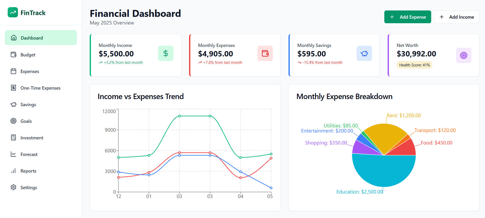
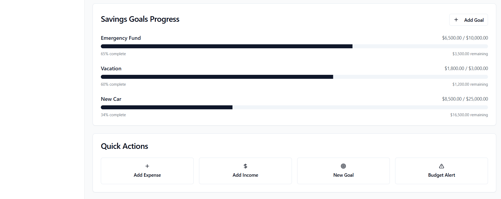
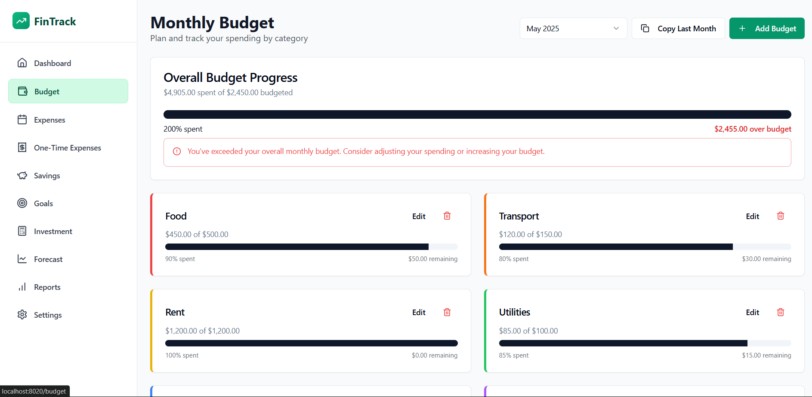
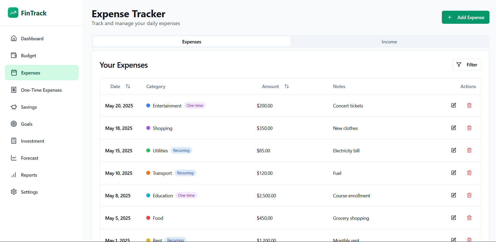
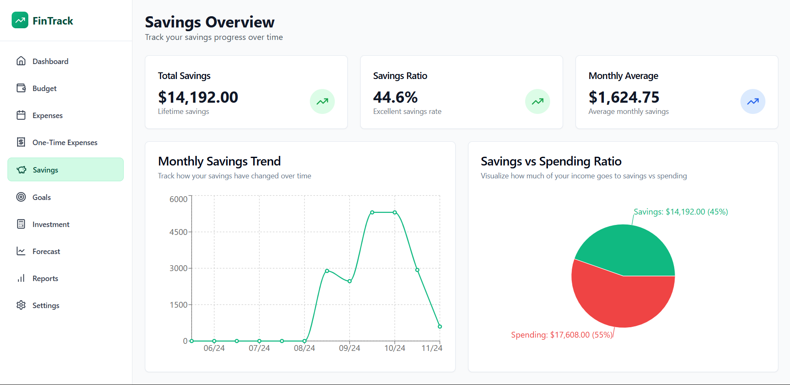
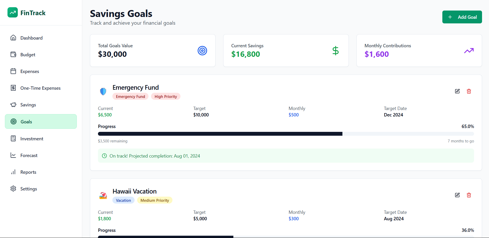
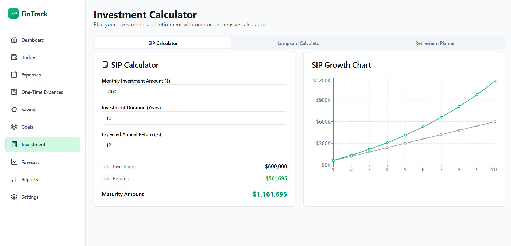
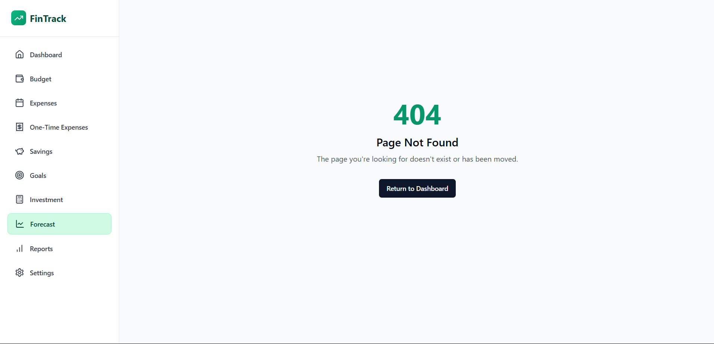
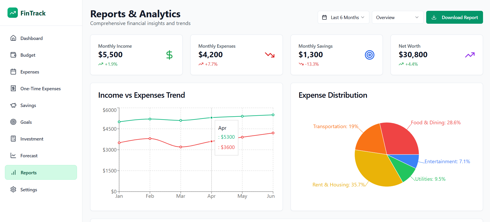
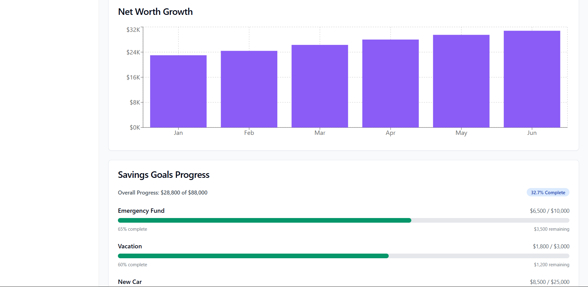

# FinTrack – Smart Personal Finance Manager

A comprehensive personal finance management application built with React, TypeScript, and Tailwind CSS. FinTrack helps users track expenses, manage budgets, set savings goals, and forecast their financial future.

## Features

- **Dashboard**: Overview of your financial health with key metrics and visualizations
- **Budget Management**: Set and track category-wise budgets
- **Expense Tracking**: Log and categorize daily expenses
- **One-Time Expense Tracking**: Separate tracking for large or unexpected expenses
- **Savings Goals**: Set and monitor progress towards financial goals
- **Investment Calculator**: Plan your investments with SIP and lumpsum calculators
- **Financial Forecasting**: Project your future net worth based on current habits
- **Reports & Analytics**: Visualize your financial data with charts and graphs
- **Dark/Light Mode**: Choose your preferred theme
- **Responsive Design**: Works on both mobile and desktop

## Screenshots

### Dashboard


### Budget Overview


### Expense Tracker


### One-Time Expenses


### Savings Overview


### Savings Goals


### Investment Calculator


### Financial Forecast


### Reports & Analytics


### Settings


## Tech Stack

- **Frontend**: React, TypeScript
- **State Management**: Zustand
- **Styling**: Tailwind CSS, shadcn/ui
- **Charts**: Recharts
- **Routing**: React Router
- **Build Tool**: Vite

## Getting Started

1. Clone the repository
2. Install dependencies:
   ```
   npm install
   ```
3. Start the development server:
   ```
   npm run dev
   ```
4. Open your browser and navigate to `http://localhost:5173`

## Author

- **Nidhchay** - [GitHub Profile](https://github.com/nidhchay)

## License

This project is licensed under the MIT License - see the LICENSE file for details.